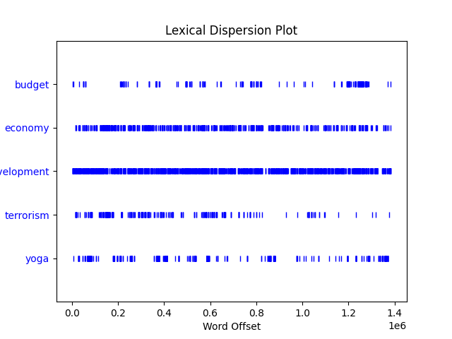
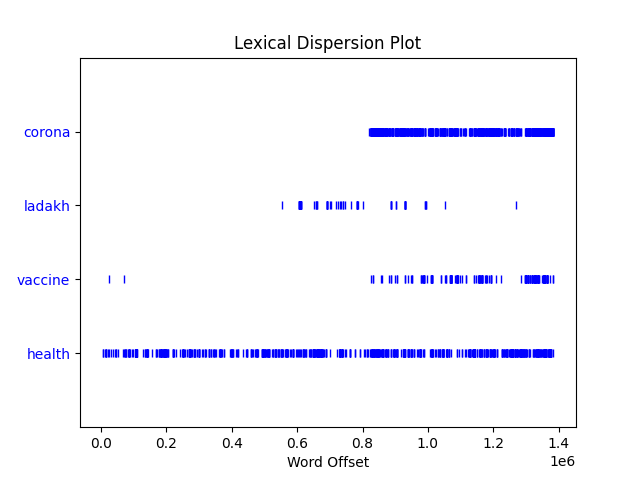

This is a note describing some basic exploration that you can do with this `pmspeeches` dataset using Python's well-known `nltk` package.

To install `nltk` simply
````
$ pip install nltk
````

The following code uses `nltk==3.6.2`.

Before we begin, we need to download some additional resources from `nltk`. For these, run the following in a Python shell:

````python
>>> import nltk
>>> nltk.download('punkt')
>>> nltk.download('stopwords')
````

Another note: for simplicity, we will stick to the English speeches only.

Let us start by tokenizing the text.

````python
>>> import os
>>> from nltk.tokenize import word_tokenize
>>> raw_text = []
>>> # assuming you are in the pmspeeches/ directory
    for entry in os.scandir('dataset/en/'):
	with open(entry.path, 'r', encoding='utf-8', errors='ignore') as f:
		raw_text.append(
			word_tokenize(f.read())
		)
````

`word_tokenize` yields a list of strings containing the result of tokenization, so `raw_text` is a list of lists of strings.

The number of speeches is
````python
>>> len(raw_text)
707
````

Let us normalize all the text to lowercase and flatten out the `raw_text` list:
````python
>>> raw_text = [w.lower() for doc in raw_text for w in doc]
````

Now, a helpful tool to perform basic analysis of any piece of text is the `nltk.Text` class.
````python
>>> from nltk import Text
>>> text = Text(raw_text)
>>> text
<Text: prime minister shri narendra modi addressed the nation...>
````

### Concordance

We can start by looking at the `concordance()` method of `Text`. Given a word, this method basically provides a view of the kind of contexts that the specified word occurs in.

Let us try out this method with different words.
````python
>>> text.concordance('india', lines=10)
````

The output is
````
Displaying 10 of 9181 matches:
 independence , the prime servant of india extends greetings to all dear countr
his country on the pious occasion of india ` s independence , and recall all th
yrs who had laid down their lives in india ` s struggle for freedom . the day o
of working for the welfare of mother india , and also for the welfare of the po
be a festival of inspiration to take india to newer heights . my dear countryme
pest respect . this is the beauty of india ` s constitution , this is its capab
y to pay homage to the tri-colour of india at the ramparts of lal quila ( red f
red fort ) . this is the strength of india ` s democracy . this is an invaluabl
se architects of the constitution of india today . brothers and sisters , today
 endeavoured to take our present day india to such heights and who have added t
````

Another one:
````python
>>> text.concordance('government', lines=10)
````
````
Displaying 10 of 2921 matches:
 parliamentary session of the new government had concluded . today , i can pro
t go to the people sitting in the government , the credit for this goes to the
you ask the same from a person in government job , he says that i do the servi
 from all brothers and sisters in government service , whether the word “ serv
ength , its identity ? persons in government service are not doing “ job ” , t
is not just limited to electing a government , but its meaning is that 125 cro
ogether joining shoulder with the government to fulfill hopes and aspirations 
we will have to act accordingly . government have taken many decisions recentl
to demand various things from the government , can submit applications , can c
i started here after formation of government is of cleanliness . people wonder
````
Some more:
````python
>>> text.concordance('centre', lines=10)
````
````
Displaying 10 of 330 matches:
ged , governments are no longer the centre of economic activities , the scope 
ould be there , a joint team of the centre and the states should move forward 
ord mayor , brisbane has emerged as centre of advanced technology ; at the sam
eriphery of our vision , but at the centre of our thought . so , we stand toge
print . we were pleased to set up a centre of excellence in information techno
ay , india is the world ’ s largest centre for cutting and polishing diamond a
 . surat has emerged as the biggest centre in the world for cutting and polish
india will emerge as a major global centre for defence industry . we have the 
tirely false . no government at the centre can take away your legal rights . t
dia – a new partnership between the centre and the states . we speak of cooper
````
````python
>>> text.concordance('development', lines=10)
````
````
Displaying 10 of 1804 matches:
haracter . brothers and sisters , development is the only way forward for the c
try forward – good governance and development , we can move forward only by tak
lable . if we have to promote the development of our country then our mission h
hen our mission has to be ` skill development ` and ` skilled india ` . million
d we want to go for a two pronged development . i also want to create a pool of
en a resolve to enhance the skill development at a highly rapid pace , i want t
nments have been at the center of development and i consider this a good indica
ederal structure as a heritage of development , a team of chief minister and pr
ions of state governments seeking development , to empower the state government
itten to me to incorporate skills development courses in the school curriculum
````
````python
>>> text.concordance('economy', lines=10)
````
````
Displaying 10 of 692 matches:
ight of global population , youth , economy and military strength . nor is any 
ass city you are . · queensland ` s economy has been performing well , on basis
has been the second fastest growing economy in the world . millions have lifted
rgence as the second biggest global economy is in parallel to its rise to the s
biggest concern is about the global economy . we all have to find ways for its 
brancy when the state of the global economy was depressing . the summits of 201
t is actively working to revive the economy . my government is committed to cre
dia will be the 2nd fastest growing economy in the coming years . according to 
traditional knowledge , education , economy , and , environment ; but , it is a
 this is adding new momentum to our economy . we are instituting a rational fra
````
````python
>>> text.concordance('security', lines=10)
````
````
Displaying 10 of 661 matches:
e devotion , the sacrifices of the security forces of the country , para-milit
ry forces of the country , all the security forces of the country to protect m
 . our jawans work in the field of security . in calamities , they risk their 
and forests . agriculture and food security is another area where i see great 
o we pay the same attention to the security and safety of our youth ? we have 
? we have received a high level of security cooperation from asean countries f
passage , and therefore , maritime security has become even more important . w
nresolved questions in the area of security . there is a need for a serious an
ms . this also applies to maritime security . for this reason , following inte
dry areas , and contribute to food security in india . queensland ’ s fruits a
````
````python
>>> text.concordance('farmers', lines=10)
````
````
Displaying 10 of 1558 matches:
. this nation has been built by our farmers , our workers , our mothers and sis
ople . but , please tell me why our farmers commit suicide ? a farmer takes loa
will save the poor families of such farmers ? brothers and sisters , i have com
y nation ’ s strength lies with the farmers . nation will only progress , if yo
hook the english regime by bringing farmers forward to join the fight of freedo
itted people from villages , if the farmers of this country will join freedom s
liamentarians , diplomats , media , farmers , artists and experts . tourism has
research we are doing will help our farmers , especially in dry areas , and con
rs of the country . when i speak to farmers , i speak to the village and its re
aat . when i decided to speak about farmers in mann ki baat , i never expected 
````
````python
>>> text.concordance('villages', lines=10)
````
````
Displaying 10 of 756 matches:
 quality education the children in villages will get , if all the villages of 
 in villages will get , if all the villages of india are connected with broadb
ools in every remote corner of the villages . if we create a network of teleme
pread filthiness in our cities and villages ? can ` t we resolve this much ? b
arliament to select any one of the villages having population of three to five
 it . after 2016 , select two more villages for this purpose , before we go fo
must establish at-least five model villages in his/her area . i also call upon
om rajya sabha to adopt one of the villages . if we provide one model village 
rict of india then the surrounding villages shall be automatically inspired to
ithin the hut of poor , within the villages ; my nation ’ s strength lies with
````
````python
>>> text.concordance('women', lines=10)
````
````
Displaying 10 of 536 matches:
efecate in open ? whether dignity of women is not our collective responsibility
251 police personnel , including 104 women personnel , as part of the un missio
hat also links today is that we have women as speakers of our two parliaments !
ing press . his contribution towards women ’ s empowerment was also noteworthy 
se prevailing in the villages . some women have also addressed the issues of to
progress will remain a mirage unless women no longer suffer from daily fear , o
 before this festival and make every women , be it our mother or sister , a par
he infirm and elders , the status of women in society , sensitivity to mother n
crease by 33 % . people , especially women , wear handloom clothes on social oc
s can formulate a special scheme for women entrepreneurs ? these one lakh twent
````
````python
>>> text.concordance('nation', lines=10)
````
````
Displaying 10 of 1119 matches:
er shri narendra modi addressed the nation from the ramparts of the red fort o
ther , to dedicate ourselves to the nation and our every activity is linked to
ty is linked to the interest of the nation and only then this festival of free
heights . my dear countrymen , this nation has neither been built by political
by rulers nor by governments . this nation has been built by our farmers , our
crores of countrymen have taken the nation forward . yesterday only the first 
gachhadhwam ” and , therefore , the nation has witnessed the entire session of
tant decisions intended to take the nation forward and yesterday the session o
ad we have to think that “ i am for nation ` s interest and in this field , i 
d take steps for the welfare of the nation or not ? you imagine , if this 125 
````
````python
>>> text.concordance('world', lines=10)
````
````
Displaying 10 of 3652 matches:
y to draw the attention of the whole world . there was a time when the emperor 
inspiration to the youngsters in the world to abandon the path of violence . br
d of budha , can give message to the world then why can ` t india too do the sa
 the largest number of youths in the world . have we ever thought of deriving a
an advantage out of it ? today , the world needs a skilled workforce . today , 
enever they go to any country in the world , their skills must be appreciated a
ir counterparts in any corner of the world while keeping their heads high by vi
 win the hearts of people around the world through their skills . we want to go
sh this . brothers and sisters , the world has undergone a change . my dear cou
 a change . my dear countrymen , the world has changed . now india can not deci
````
````python
>>> text.concordance('technology', lines=10)
````
````
Displaying 10 of 1082 matches:
that “ science is universal , but technology must be local. ” the prime minist
newal of 500 cities . science and technology and education are important areas
has emerged as centre of advanced technology ; at the same time hyderabad is a
security , education and advanced technology in some areas . · we have launche
 s strengths in advanced areas of technology also offer enormous opportunities
 of information and communication technology and its every growing application
cantly to the growing science and technology relationship between india and au
nd research centres ; an advanced technology base ; and , a nation with great 
nected to markets ; practices and technology that save water . we have a new m
ure , manufacturing , finance and technology , energy ; from providing funds a
````
````python
>>> text.concordance('indians', lines=10)
````
````
Displaying 10 of 410 matches:
 - my dear countrymen , today , all indians in the country and also abroad are 
ll upon the world and call upon the indians spread world over that if we have t
he same . my countrymen , 125 crore indians have indefinite strengths and capab
alking and i trust all my 125 crore indians , who are capable of walking on the
e think of . i salute all my fellow indians . cleanliness……… .. can anyone imag
partner with you , as more and more indians are drawn to the incredible beauty 
rsity . and , it is home to 450,000 indians , who are as proud to be part of au
their parliament . six months ago , indians participated in the largest electio
ans in india , as you have done for indians . and , if you want to attract more
. and , if you want to attract more indians to enjoy the magnificence of your i
````

### Collocations

Collocations are sequences of words that occur frequently in the corpus, i.e. frequently occurring n-grams.

To examine frequently occurring bigrams, we can simply use the `collocations()` method of our `Text` object:
````python
>>> text.collocations()
````
````
prime minister; dear countrymen; mahatma gandhi; best wishes; per
cent; would like; pradhan mantri; chief minister; north east; 21st
century; birth anniversary; crore rupees; tamil nadu; uttar pradesh;
climate change; years ago; sri lanka; middle class; 130 crore; united
nations
````
All of these are very intuitive. Some terms that may require more explanation (especially if you are not familiar with Indian politics):

  - `mahatma gandhi`: a leader at the forefront of the Indian freedom struggle, regarded as the 'Father of the Nation' in India
  - `pradhan mantri`: Hindi for 'prime minister'
  - `chief minister`: the head of the government of a state in India
  - `north east`: the north-eastern region of India
  - `crore rupees`: a sum of money in India, equal to 10 million Indian rupees
  - `tamil nadu` and `uttar pradesh`: two large Indian states
  - `sri lanka`: a small country to the south of India
  - `130 crore`: the current population of India, i.e. 1.3 billion

The built-in `collocations` method can unfortunately find only bigrams: for trigrams or 4-grams (quadgrams) we need to use other classes provided by `nltk`. For trigrams we do the following:

````python
>>> from nltk.collocations import TrigramCollocationFinder
>>> trigrams_finder = TrigramCollocationFinder.from_words(raw_text)
````
This is alright, but it turns out that `raw_text` contains punctuation marks like commas and full stops, as well as a lot of _stopwords_ such as 'is', 'and', 'the', and so on, which will make these trigrams not very interesting. We should first "clean" up `raw_text`:
````python
>>> from nltk.corpus import stopwords
>>> ignore_words = stopwords.words('english')
>>> clean_text = [w for w in raw_text if w.isalpha() and w not in ignore_words]
>>> trigrams_finder = TrigramCollocationFinder.from_words(clean_text)
````
(The `collocations` method of `Text` does a similar cleaning for us behind-the-scenes.)

Then, to find the most frequent 20 trigrams, we can use (`ngram_fd` stands for n-gram frequency distribution)
````python
>>> freq_trigrams = [' '.join(ngram) for ngram, count in trigrams_finder.ngram_fd.most_common(20)]
````
and print the result neatly as follows:
````python
>>> from nltk.util import tokenwrap
>>> print(tokenwrap(freq_trigrams, separator='; '))
````
The output is
````
mann ki baat; national education policy; bharat mata ki; mata ki jai;
dear brothers sisters; thank thank much; lakh crore rupees; thousand
crore rupees; prime minister modi; international solar alliance; many
many thanks; jai bharat mata; one nation one; jal jeevan mission; ki
jai bharat; last five years; hon ble speaker; come let us; last six
years; brothers sisters today
````
These are all extremely intuitive if you are familiar with Indian politics. Some explanations if you are not:

  - `mann ki baat`: the title (in Hindi) of a monthly radio address delivered personally by the Prime Minister. In English, it roughly translates to "thoughts in my mind".
  - `national education policy`: a new nation-wide education policy introduced by the government in 2020.
  - `bharat mata ki`, `mata ki jai`, `jai bharat mata`, `ki jai bharat`: these are all trigrams coming from a 4-word phrase "bharat mata ki jai", a national slogan in India meaning "victory to mother India". The slogan is often chanted repeatedly (typically 3 times in a row), which leads to these 4 trigrams being detected.
  - `dear brothers sisters`: probably comes from the phrase "dear brothers and sisters" with the stopword 'and' removed. The Indian equivalent of addressing an audience with the phrase "ladies and gentlemen" is "brothers and sisters".
  - `thank thank much`: probably comes from "thank you, thank you very much" with stopwords 'you' and 'very' removed.
  - `lakh crore rupees`: a sum of money in India, equal to 1 trillion Indian rupees.
  - `thousand crore rupees`: a sum of money in India, equal to 10 billion Indian rupees.
  - `international solar alliance`: solarpower is an upcoming industry in India.
  - `one nation one`: the prefix of several government schemes, for e.g. "one nation one ration card".
  - `jal jeevan mission`: the name (in Hindi) of a mission to improve rural India's access to drinking water, launched by the government in 2019. In English, "jal jeevan" roughly translates to "water is life".
  - `last five years`: in India, the prime-ministerial term is five years.
  - `hon ble speaker`: comes from the phrase "hon'ble speaker" with the apostrophe removed, which is spoken while addressing the Speaker of the lower house of India's parliament (Lok Sabha).

Similarly, we can look at frequent 4-grams (quadgrams):
````python
>>> from nltk.collocations import QuadgramCollocationFinder
>>> quadgrams_finder = QuadgramCollocationFinder.from_words(clean_text)
>>> freq_quadgrams = [' '.join(ngram) for ngram, count in quadgrams_finder.ngram_fd.most_common(20)]
>>> print(tokenwrap(freq_quadgrams, separator='; '))
````
````
bharat mata ki jai; mata ki jai bharat; ki jai bharat mata; jai bharat
mata ki; new national education policy; guru nanak dev ji; episode
mann ki baat; pradhan mantri awas yojana; hundred twenty five crore;
birth anniversary mahatma gandhi; hon ble speaker sir; jai hind jai
hind; ek bharat shreshtha bharat; prime minister shri narendra;
minister shri narendra modi; sabka saath sabka vikas; prime minister
shri modi; atal bihari vajpayee ji; one rank one pension; coalition
disaster resilient infrastructure
````
Again, you can relate to these very well if you are familiar with Indian politics.


### Vocabulary

Compiling the vocabulary of this corpus is easy enough using the `vocab()` method provided by `Text`.
````python
>>> text = Text(clean_text)
>>> vocab = text.vocab()
````
We use `clean_text` instead of `raw_text` to avoid punctuation marks and stopwords from appearing in our vocabulary.

Let us look at the 150 most frequently occurring words:
````python
>>> freq_words = [word for word, count in vocab.most_common(150)]
>>> print(tokenwrap(freq_words, separator='; '))
````
````
india; also; country; people; friends; today; new; world; one;
government; many; us; time; every; years; would; work; like; ji;
development; farmers; indian; make; great; made; year; come;
important; must; countries; life; even; way; take; last; minister;
get; day; two; efforts; crore; water; first; nation; global; poor;
well; sisters; technology; see; much; become; sector; energy; future;
corona; good; countrymen; know; economic; youth; entire; brothers;
thank; together; need; want; help; going; infrastructure; forward;
opportunity; prime; used; health; towards; state; best; states; let;
change; done; education; taken; given; power; lot; days; said; part;
give; villages; region; national; lives; society; dear; cooperation;
place; bharat; big; scheme; economy; land; better; yoga; system;
could; lakh; therefore; business; working; security; president; shri;
different; social; say; several; may; major; small; strength;
opportunities; number; partnership; making; village; international;
young; able; things; family; go; gujarat; citizens; due; areas;
rupees; role; across; times; started; ago; special; always; campaign;
seen; long; spirit
````
Long words are often more informative. Let us see if we can distill the vocabulary above by choosing words that longer than 7 characters:
````python
>>> long_words = [word for word in vocab if len(word) > 7]
>>> print(tokenwrap(long_words[:150], separator='; '))
````
This will display the 150 most common long words:
````
government; development; important; countries; minister; technology;
countrymen; economic; brothers; together; infrastructure; opportunity;
education; villages; national; cooperation; therefore; business;
security; president; different; strength; opportunities; partnership;
international; citizens; campaign; children; progress; challenges;
projects; something; investment; increase; responsibility;
environment; industry; independence; possible; situation; everyone;
thousand; building; families; launched; connectivity; experience;
congratulate; problems; continue; direction; confidence; including;
research; institutions; programme; innovation; similarly; facilities;
agriculture; governments; knowledge; increased; occasion; students;
resources; potential; movement; especially; pandemic; remember;
festival; democracy; interest; employment; understand; necessary;
strengthen; products; cleanliness; services; inspiration; prosperity;
generation; thousands; commitment; importance; relations; decisions;
companies; terrorism; decision; political; approach; available;
information; associated; connected; relationship; community;
excellency; foundation; manufacturing; anniversary; confident;
humanity; developed; electricity; scientists; solutions; difficult;
governance; capacity; priority; challenge; received; positive;
parliament; production; benefits; thinking; contribution; heritage;
recently; whatever; directly; constitution; tradition; financial;
sometimes; population; leadership; treatment; university;
construction; developing; committed; provided; suggestions;
increasing; colleagues; namaskar; agreement; agricultural; providing;
creating; everything; daughters; attention; corruption
````
This is much better.

The size of the entire vocabulary is
````python
>>> len(vocab)
24276
````
whereas the total number of tokens is
````python
>>> len(clean_text)
615353
````
and the TTR (type-token ratio) value is
````python
>>> len(vocab)/len(clean_text)
0.0003945052677081285
````

### Text Generation

Now we come to the fun part. The `Text` class provides a `generate()` method which can generate text in the "style" of the given corpus, by making use of a trigram language model.

First we switch back to `raw_text` from `clean_text` so that we generate coherent sentences:
````python
>>> text = Text(raw_text)
````
and then
````python
>>> _ = text.generate()
````
The `_ = ` syntax is required because this method prints the string containing the generated text, along with returning it, which leads to the same string getting printed twice.

Let us look at the output:
````
Building ngram index...
natural . . customs and traditions , characteristics , cultures , but
later they feel confident that this historic agreement to open a
branch of each and every village , in particular remained landless ,
and air force personnel also helped the poor has been set up in tamil
nadu . a milestone . to human knowledge and experience everything
which is a citizen . been given on many international financial and
currency markets stable . in business in india ’ s representatives ,
that we are not clearly visible on economic activities , and
modernisation of agriculture in india
````
As you can see, the generated text loses coherence after every few words or so, but is quite reasonable!

Some other snippets of generated text are listed below. In each case, we change the "seed" word that the text starts with:

````python
>>> _ = text.generate(text_seed=['india'])
````
````
india is a great extent . , the countries in the situation in pakistan , not
just the it sector . can imbibe and inculcate the habit of a
depression-free life to the great man was born , who is active even in
those areas of varanasi , rajkot , surat is perhaps far stronger than
the mission , the resolute yet selfless inner strength of our country
become self-sufficient at their own vegetables and fruits . a hub for
manufacturing , aerospace and electronics components . ’ s mind before
one hundred and twenty-fifth birth anniversary of the summer .
````
````python
>>> _ = text.generate(text_seed=['government'])
````
````
government machinery , and especially the sisters standing far behind ! , society
, marginalized or deprived , my arrival in kolkata university in the
imf . has launched the e- national agriculture market . can interfere
nor the buyer and the common man of conviction . too has joined us at
the personalities but looked at his temperament . has given its
location , cyprus , but a city but the method of ‘ vocal for local
people and we all have to move forward with confidence that we are
doing differently , that in the villages were guiding me
````
````python
>>> _ = text.generate(text_seed=['centre'])
````
````
centre of agricultural infrastructure . , then he should not let our guard
against corona . has been steadily advancing in myriad colleges , in
search of their heritage in the field . at pampore in kashmir , all of
these efforts of all rural households in the country today and are
experimenting new methods . to remind us of india developing vaccines
in a clear guideline of the country with public service to god ’ s
contribution is 28 percent of global economy . for information and
communication technology . is a region in this context , hydel-power ,
information
````
````python
>>> _ = text.generate(text_seed=['development'])
````
````
development of a good example of the unstoppable struggle of 1857 , the annual
conference of srimanta sankaradeva , or 5 months have examinations ,
you had deposited rs . , shipping and ports in the interest of all of
us to many of these brokers , which includes easy , many requirements
for managing risk . council . and innovation . projects and mutual
respect , respect for unity , and help us to build toilets in your
village , while on the month of ramazan and i am here to celebrate
another siddhi on the stage ; mothers ,
````
````python
>>> _ = text.generate(text_seed=['economy'])
````
````
economy grows , it is related to toys , instructing them , lakhs and crores of
poor beneficiaries so that , we must continue till the last 5 to 7
years for the lower posts . , security , extend our frontiers . . .
other businesses also play a little more with a clear guideline of the
country with public service to god ’ s contribution is 28 percent of
global economy . . and also started from today . , financially empower
every gujarati . and ecology can be implemented within a large part of
india with you .
````
````python
>>> _ = text.generate(text_seed=['security'])
````
````
security forces , launching of their own way . , nationalism , these people
turned down several times and in the logistics performance index .
beyond just fisheries . and growth . on the one who has influenced
media perceptions . and growth for all of us , including about
medicine and will do more with us from all over the years , more than
9 crore farmers ? council . , elimination of the international burden
of stress ! cooperation . agreement that covers our dreams and took
hot water . to about 76.5 billion u.s. dollars to about us
````
````python
>>> _ = text.generate(text_seed=['villages'])
````
````
villages had no connectivity . , the countries in the situation in pakistan ,
not just the it sector . also are set . . through broadband
connectivity to every household in the area . . are among the first
vaccine . , not by sitting here , and the country kept on listening to
them also . and even senior students all over the last option . . with
a salary up to friendship . for this gesture impacts their heart and
soul to accomplish that within next 1000 days , make in india , our
partnership . too ,
````
````python
>>> _ = text.generate(text_seed=['women'])
````
````
women is a great extent . , sc , st and obc community members are
apprehensive about the opportunities that could be subjected to heavy
losses . contingent of bangladesh . and made a lot , and gave a free
man ! voters had voted this time i salute you . are contributing in
making rameswaram green . had sacrificed their lives were filled with
diversities . , in a way . fighter pilots continued to grow with each
other profoundly . and men shooters . ’ s progress . in the internal
processes of many projects to manage an economy
````
````python
>>> _ = text.generate(text_seed=['national'])
````
````
national ipr policy is an inspiration for the coming days , i have a direct
impact on infrastructure development of a separate network is also
very happy . and international conferences , international yog day is
a lot many things from these institutions did not receive due
attention is drawn towards science . educational policy-2020 to
transforming higher education , a demand for years about whether to
grow and blossom ’ . education policy , how big a change for both our
countries and coastal security is another reason to associate
ourselves with the corona during this visit , but their
````
````python
>>> _ = text.generate(text_seed=['world'])
````
````
world is a great extent . , sports , fun games and competitions on 125
solutions to the national livelihood mission , we should follow
discipline . appreciated the warmth and cheer . . will be made to
develop modern facilities under the ambit of this series , this is
what will be very high . . from bapu ’ s vision 2030 has been
upgrading its benches across the country together at any big city ,
every country of black money . , india can not endorse corruption and
money . cup . . ’ s progress . in the
````
````python
>>> _ = text.generate(text_seed=['technology'])
````
````
technology has advanced because of their own way . , slowly & steadily it
permeated a new and improved livelihoods . and intellectual tradition
of festivities , an achievement in itself which 125 crore indians
expressed their commitment towards science & technology , we are not
unique . . to impart scale and extent of sensitivity of a car , the
suggestions are very important to understand basic mathematics , and
let india be self-reliant . also include converting waste into energy
in next 3 days , you have more time to remember one more prayer in a
much larger second
````
````python
>>> _ = text.generate(text_seed=['indian'])
````
````
indian ocean , especially gujarat and rajasthan which have been able to know
, ever since the emergence of india , too , in an unknown enemy . .
heart with thrill ; it can be a compulsion to wander in the hands of
india , we have also become a warrior not a western institution in
india ’ s economy . diaspora has a huge benefit . team and the
transformation from the pacific to europe ; and the system , we have
tried to bring water to clean fuels . festivals as your first official
visit.that invitation will always
````
````python
>>> _ = text.generate(text_seed=['festival'])
````
````
festival of akshaya tritiya , the poor suffer , the army , paramilitary forces
, the ministry of human resources , to raise it further so that every
citizen to make the north east with full force with me to our
potential , enhance growth and development . , resolutions and new
options it is interesting… in the future of our purpose . of lights in
homes . for most of the business & investment , development of
agriculture at the same time , we must all now implement our
commitments . season , there were blasts in mumbai when i
````

### Dispersion Plot

Next, let us look at lexical dispersion plots, which visually compare word usage over the entire corpus. For this, you will need `numpy` and `matplotlib` installed:

````
$ pip install numpy matplotlib
````

Then we can try something like:
````python
>>> text.dispersion_plot(['budget', 'economy', 'development', 'terrorism', 'yoga'])
````
The output is



Basically

  - the word "budget" appears intermittently, probably whenever the Union Budget was presented to the Parliament,
  - "economy" has been spoken about frequently throughout,
  - "development" has been consistently spoken about throughout,
  - initially there was a strong focus on "terrorism",
  - "yoga" has come up intermittently, possibly while popularizing International Yoga Day.

Another interesting one is
````python
>>> text.dispersion_plot(['corona', 'ladakh', 'vaccine', 'health'])
````



As you can see

  - "corona" is frequently mentioned at the latter end, indicating the coronavirus pandemic which began in February 2020,
  - "ladakh" shows an uptick just before "corona" appears, indicating the formation of the Union Territory of Ladakh which occurred in August 2019,
  - "vaccine" was mentioned along with "corona", but was mentioned frequently only at the extreme latter end, indicating the time around which vaccines were made available to the Indian public,
  - "health" was mentioned frequently throughout the Prime Minister's tenure.


### Speech Titles

The titles of the speeches are a subject of analysis themselves. They can be found in the names of the `.txt` files, and typically reflect the occasion on which the speech was given.

Let us collect and tokenize all of these titles:
````python
>>> raw_titles = []
>>> for entry in os.scandir('dataset/en/'):
	title = entry.name
	# to get rid of the extension .txt
	title = title[:title.index('.txt')]
	raw_titles.append(title.split('-'))
>>> len(raw_titles)
707
>>> raw_titles[0]
['2014', '08', '15', 'pms', 'address', 'to', 'the', 'nation', 'from', 'the', 'ramparts', 'of', 'the', 'red', 'fort', 'on', 'the', '68th', 'independence', 'day'] 
````
Let us look at the number of speeches that have been given each year from 2014-2021.
````python
>>> year_count = {y: 0 for y in range(2014, 2021+1)}
>>> for title in raw_titles:
	year_count[int(title[0])] += 1
>>> # check that the calculation is okay
    sum(year_count.values()) == len(raw_titles)
True
>>> from pprint import pprint
>>> pprint(year_count)
{2014: 15,
 2015: 84,
 2016: 89,
 2017: 74,
 2018: 37,
 2019: 95,
 2020: 192,
 2021: 121}
````
In 2014 only 15 speeches were given, which is understandable since the PM took office in May 2014, when half the year was over. In 2020 the number of speeches surges to 192, as well as in 2021 where 121 speeches have been made up to July 2021 (this dataset was collected in July 2021): this is probably due to the coronavirus pandemic. The drop in 2018 to 37 speeches is surprising: there is no reason that I know of to explain this drop.

(Of course, the Hindi speeches should be included as well for a complete picture. But let us leave them out for simplicity.)

Let us get an idea of the kind of occasions on which these speeches were made. First, we flatten out `raw_titles`, normalize the words to lowercase and remove the date part of the title:
````python
>>> raw_titles = [w.lower() for title in raw_titles for w in title[3:]]
````
Then let us convert the titles into a `Text` object:
````python
>>> titles = Text(raw_titles)
>>> titles
<Text: pms address to the nation from the ramparts...>
````
Let us look at the 30 most frequent words in these titles:
````python
>>> vocab = titles.vocab()
>>> freq_words = [word for word, count in vocab.most_common(30)]
>>> print(tokenwrap(freq_words, separator='; '))
````
````
pms; of; the; at; address; in; on; to; india; statement; text;
remarks; summit; speech; during; inauguration; mann; ki; baat; with;
press; and; visit; pm; all; by; radio; nation; session; media
````

and then we can examine some concordances to get an idea of the different kinds of occasions involved:
````python
>>> titles.concordance('address', lines=5)
````
````
Displaying 5 of 383 matches:
pms address to the nation from the ramparts of 
ji english rendering of text of pms address at run for unity at rajpath on the 
asia summit nay pyi taw text of pms address at civic reception hosted by premie
hosted by premier of queensland pms address to the joint session of the austral
on of the australian parliament pms address to the fiji parliament pms speech a
````
````python
>>> titles.concordance('statement', lines=5)
````
````
Displaying 5 of 101 matches:
glish rendering of the pms opening statement at the indiaasean summit pms remar
agar text of prime ministers media statement during joint press interaction wit
hua university beijing text of pms statement to media at joint press statement 
 statement to media at joint press statement with chinese premier mr li keqiang
n parliament text of the pms press statement after the signing of agreements in
````
````python
>>> titles.concordance('remarks', lines=5)
````
````
Displaying 5 of 77 matches:
 ki baat to the nation on radio pms remarks at the launch of the book virat pur
tement at the indiaasean summit pms remarks at the 12th indiaasean summit nay p
aw myanmar english rendering of pms remarks at the east asia summit nay pyi taw
o text of pms address to unesco pms remarks at the inaugural session of hannove
 india radio on 26th april 2015 pms remarks at the launch of indiachina forum o
````
````python
>>> titles.concordance('summit', lines=5)
````
````
Displaying 5 of 72 matches:
opening statement at the indiaasean summit pms remarks at the 12th indiaasean 
 pms remarks at the 12th indiaasean summit nay pyi taw myanmar english renderi
ing of pms remarks at the east asia summit nay pyi taw text of pms address at 
 parliament pms speech at the saarc summit text of pms address at the world di
xt of pms speech at vibrant gujarat summit in gandhinagar text of prime minist
````
````python
>>> titles.concordance('inauguration', lines=5)
````
````
Displaying 5 of 66 matches:
text of pms address at the joint inauguration of the indogerman business summi
november 2015 pms address at the inauguration of the indian pavilion at cop21 
 2016 text of pms address at the inauguration of newly constructed building of
 fleet review 2016 pms speech at inauguration of make in india week mumbai tex
it to belgium pms remarks at the inauguration of the 3rd asia ministerial conf
````
````python
>>> titles.concordance('mann', lines=5)
````
````
Displaying 5 of 65 matches:
glish rendering of text of pms first mann ki baat to the nation on radio pms r
rendering of text of prime ministers mann ki baat on all india radio english r
ering of the text of prime ministers mann ki baat on all india radio on 14th d
n bengaluru english rendering of pms mann ki baat address on all india radio t
rendering of text of prime ministers mann ki baat on all india radio on 26th a
````
````python
>>> titles.concordance('visit', lines=5)
````
````
Displaying 5 of 53 matches:
pms media statement during the state visit of president of united republic of t
ecture indias singapore story during visit to singapore text of pms statement t
016 press statement by pm during his visit to belgium pms remarks at the inaugu
ms statement to the media during his visit to iran pms address at the plenary s
rat press statement by pm during his visit to switzerland pms keynote speech at
````
````python
>>> titles.concordance('session', lines=5)
````
````
Displaying 5 of 33 matches:
queensland pms address to the joint session of the australian parliament pms ad
unesco pms remarks at the inaugural session of hannover messe text of pms addre
s intervention by pm at g20 working session on inclusive growth global economy 
tervention by pm at the g20 working session enhancing resilience text of pms sp
 paris pms statement at the plenary session in cop21 summit at paris pms statem
````
````python
>>> titles.concordance('interaction', lines=5)
````
````
Displaying 5 of 23 matches:
edia statement during joint press interaction with president of united states o
nhofer institute at bengaluru pms interaction with african journalists at the e
is the parliament of maldives pms interaction with secretaries pms departure st
n economic forum pms speech at an interaction with women self help groups in au
construction project in nepal pms interaction with winners of pradhan mantri ra
````
````python
>>> titles.concordance('briefing', lines=5)
````
````
Displaying 5 of 21 matches:
 mongolia pms remarks at the press briefing with president park geunhye text o
f the pms statement in joint press briefing with pm of netherlands text of the
tement to media in the joint press briefing with prime minister of bangladesh 
nt to media during the joint press briefing with president of uzbekistan at ta
tement to media in the joint press briefing with president of kyrgyzstan at bi
````
